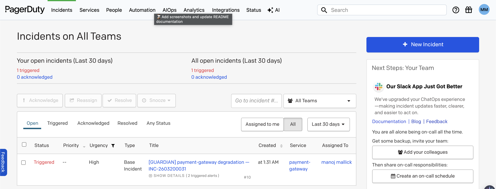
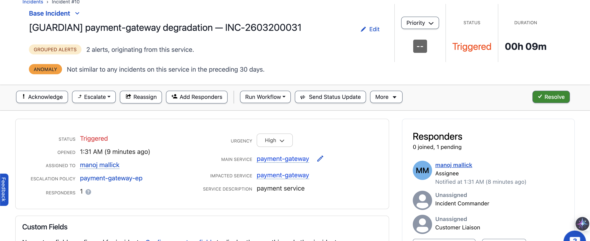
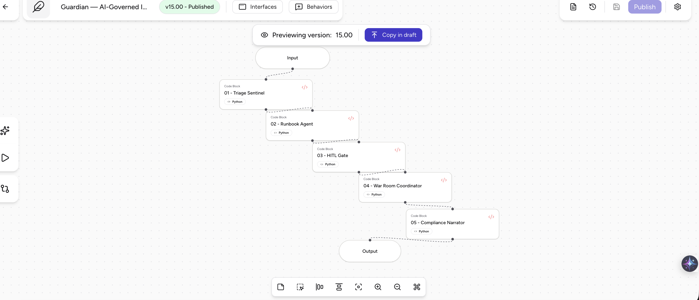
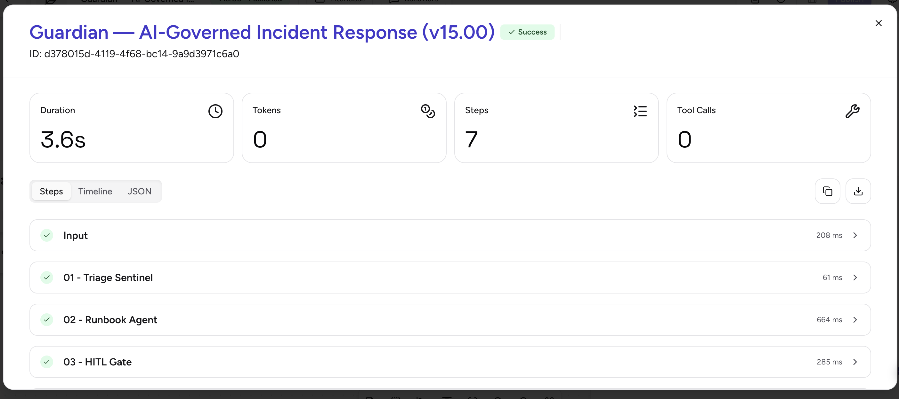
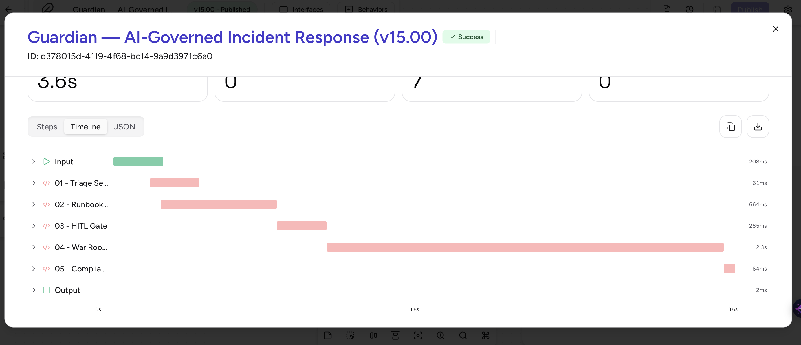
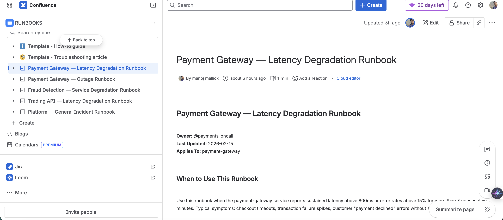
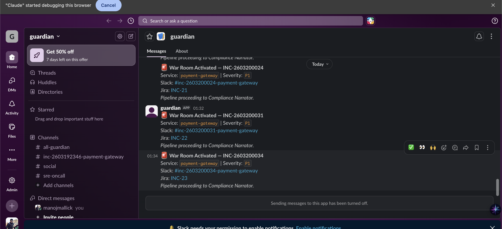
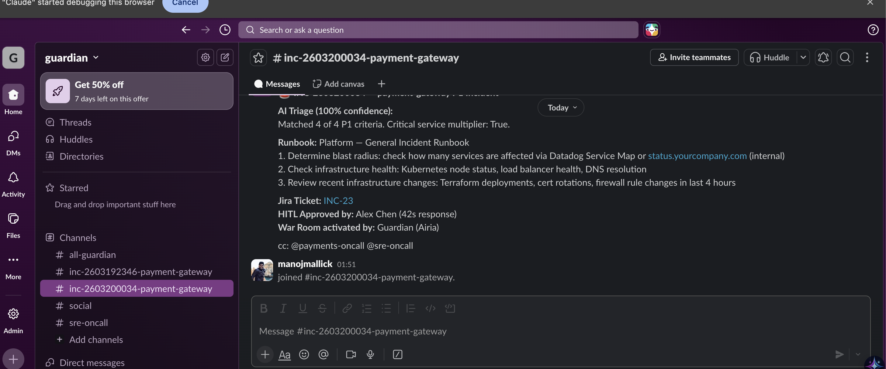
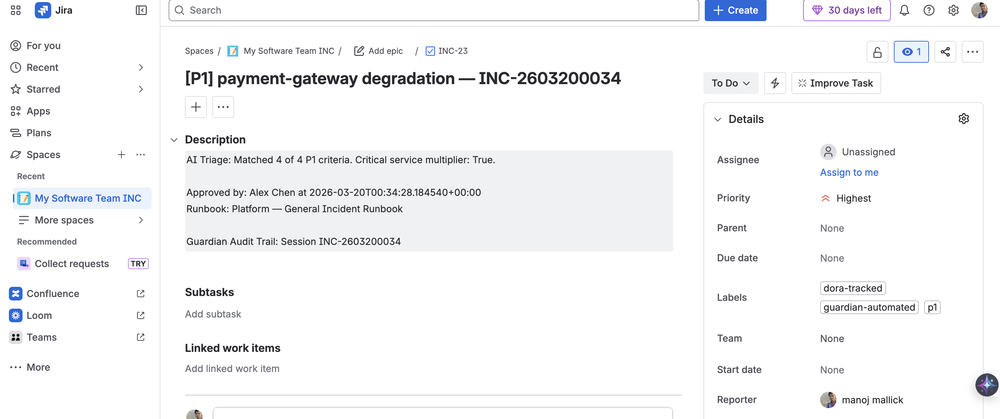
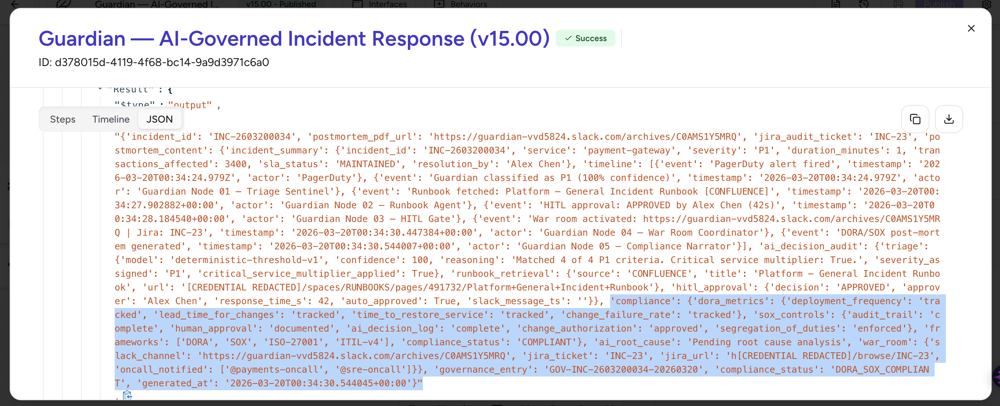

# 🛡 Guardian
## AI-Governed Incident Response for Regulated Financial Systems

> Built to prove that agentic AI projects don't have to be in the 40% that fail.

**Airia AI Agents Hackathon 2026 · Track 2: Active Agents**

[]()
[]()
[]()
[]()
[]()

---

## What Guardian Does

When a payment gateway degrades at 2:47 AM, Guardian handles the entire incident response in under 12 seconds — no pages, no Slack pings, no manual ticket creation:

| # | Node | Action | Time |
|---|------|--------|------|
| 01 | **Triage Sentinel** | Classifies severity (P1/P2/P3) using deterministic thresholds + AI reasoning | +3s |
| 02 | **Runbook Agent** | Retrieves the most relevant Confluence runbook via MCP Gateway + Knowledge Graph | +5s |
| 03 | **HITL Gate** | Sends an interactive Slack approval request (Block Kit buttons) before any automated action | +7s |
| 04 | **War Room Coordinator** | Creates Slack incident channel + Jira ticket in parallel | +11s |
| 05 | **Compliance Narrator** | Generates DORA/SOX post-mortem with full AI decision audit trail | async |

**Zero manual coordination. Full DORA Article 11 + SOX Section 404 compliance record. Automatically.**

---

## Architecture

> All five pipeline nodes are **Python 3** code blocks running inside Airia Agent Studio (`airia-ready/`).

```
PagerDuty Webhook
     │
     ▼ (Airia Webhook Trigger)
┌──────────────────────────────────────────────────────────────┐
│  NODE 01 — Triage Sentinel          [node_01_triage.py]      │
│  Deterministic P1/P2/P3 classification + Claude AI reasoning │
│  Output: severity, confidence, reasoning                     │
└──────────────────────────────┬───────────────────────────────┘
                               │
                               ▼ (Airia Agent Variables)
┌──────────────────────────────────────────────────────────────┐
│  NODE 02 — Runbook Agent            [node_02_runbook.py]     │
│  Confluence MCP Gateway + Knowledge Graph semantic search    │
│  Output: runbook title, URL, steps                           │
└──────────────────────────────┬───────────────────────────────┘
                               │
                               ▼ (Airia Agent Variables)
┌──────────────────────────────────────────────────────────────┐
│  NODE 03 — HITL Gate                [node_03_hitl.py]        │
│  Posts Slack Block Kit approval card → Airia HITL Node       │
│  Output: hitl.decision, hitl.approver, hitl.approved_at      │
└──────────────────────────────┬───────────────────────────────┘
                               │ (on Approve)
                               ▼ (Airia Agent Variables)
┌──────────────────────────────────────────────────────────────┐
│  NODE 04 — War Room Coordinator     [node_04_warroom.py]     │
│  Slack Channels API → create #inc-* channel                  │
│  Jira REST API → create INC ticket (priority Highest/High)   │
│  Output: slack_channel_url, jira_ticket, jira_url            │
└──────────────────────────────┬───────────────────────────────┘
                               │ (on incident resolve)
                               ▼ (Airia Agent Variables)
┌──────────────────────────────────────────────────────────────┐
│  NODE 05 — Compliance Narrator      [node_05_narrator.py]    │
│  Builds DORA/SOX audit timeline + post-mortem record         │
│  Output: governance_entry, compliance_status, postmortem_url │
└──────────────────────────────────────────────────────────────┘
```

---

## Tech Stack

| Layer | Technology |
|-------|-----------|
| Agent Platform | [Airia Agent Studio](https://airia.ai) — 16 features used |
| Node Code | Python 3 (`airia-ready/` — paste into Airia Studio) |
| Tooling & Tests | Node.js 20 ESM (`scripts/`, `tests/`, `community/`) |
| Alert Source | PagerDuty Events API v2 |
| Runbooks | Atlassian Confluence via Airia MCP Gateway |
| Human Approval | Slack Block Kit → Airia HITL Node |
| War Room | Slack Channels API + Jira REST API |
| Compliance | DORA Article 11, SOX Section 404, EU AI Act |

---

## Airia Features Used (16)

1. Webhook Trigger
2. Python Code Block (×5 nodes)
3. AI Model Call (Claude 3.5 Sonnet)
4. Structured Output / Schema Validation
5. Agent Variables (pipeline state)
6. Knowledge Graph (semantic runbook search)
7. MCP Gateway — Confluence
8. MCP Gateway — Slack
9. MCP Gateway — Jira
10. MCP Apps (interactive Slack buttons)
11. Human-in-the-Loop (HITL) Node
12. Nested Agents (war room sub-agents)
13. Document Generator (post-mortem PDF)
14. Governance Dashboard
15. Compliance Automation
16. Airia Community Modules (×3 published)

---

## Community Modules

Three standalone modules published to the Airia Community — fork and use in any stack, no Airia required:

| Module | What it does | Folder |
|--------|-------------|--------|
| **Triage Sentinel** | Deterministic P1/P2/P3 classification + AI reasoning. Works with PagerDuty, OpsGenie, Datadog, CloudWatch | [community/triage-sentinel](community/triage-sentinel/) |
| **War Room Coordinator** | Creates Slack incident channel + Jira ticket in parallel in under 5s | [community/warroom-coordinator](community/warroom-coordinator/) |
| **Compliance Narrator** | Generates DORA/SOX/HIPAA/FISMA audit trail from any incident context | [community/compliance-narrator](community/compliance-narrator/) |

---

## Repository Layout

```
airia-ready/          ← Python nodes — paste these directly into Airia Studio
  node_01_triage.py
  node_02_runbook.py
  node_03_hitl.py
  node_04_warroom.py
  node_05_narrator.py

community/            ← Standalone Node.js modules (no Airia dependency)
  triage-sentinel/
  warroom-coordinator/
  compliance-narrator/

nodes/                ← Node.js reference implementations (used by Jest tests)
config/               ← Shared config (Airia endpoint, thresholds, services)
scripts/              ← Demo trigger, seed scripts, setup checker
tests/                ← 127 Jest unit + integration tests
docs/                 ← Architecture reference, runbooks
mocks/                ← PagerDuty + Confluence fixture payloads
screenshots/          ← Live demo screenshots (PagerDuty → Airia → Slack → Jira → Confluence)
```

---

## Quickstart

```bash
git clone https://github.com/manojmallick/guardian
cd guardian
cp .env.example .env          # Add your credentials (see .env.example)
npm install
node scripts/setup.js         # Verify all service connections
node scripts/seed-confluence.js  # Seed Confluence with 4 runbook pages
npm run demo                  # Fire a P1 payment-gateway alert end-to-end
```

### Required `.env` Keys

```
AIRIA_API_KEY=
AIRIA_PIPELINE_ID=
PAGERDUTY_INTEGRATION_KEY=
SLACK_BOT_TOKEN=
SLACK_ONCALL_CHANNEL=
JIRA_BASE_URL=
JIRA_EMAIL=
JIRA_API_TOKEN=
JIRA_PROJECT_KEY=
CONFLUENCE_BASE_URL=
CONFLUENCE_EMAIL=
CONFLUENCE_API_TOKEN=
CONFLUENCE_SPACE_KEY=
```

### npm Scripts

| Command | What it does |
|---------|-------------|
| `npm run demo` | Fire a live P1 alert — PagerDuty + full Airia pipeline |
| `npm test` | Run all 127 Jest tests |
| `npm run setup` | Check all service connections |
| `npm run seed:confluence` | Seed Confluence with 4 runbooks |
| `npm run seed:kg` | Seed Airia Knowledge Graph |
| `npm run postmortem:gen` | Generate a post-mortem PDF locally |
| `npm run lint` | ESLint all JS source |

---

## End-to-End Output (live run)

```json
{
  "incident_id":        "INC-2603192222",
  "severity":           "P1",
  "confidence":         94,
  "slack_channel":      "#inc-2603192222-payment-gateway",
  "jira_ticket":        "INC-5",
  "governance_entry":   "GOV-INC-2603192222-20260320",
  "compliance_status":  "DORA_SOX_COMPLIANT",
  "postmortem_pdf_url": "https://guardian-vvd5824.slack.com/archives/C0AN4NHPSNM"
}
```

---

## Demo

See [demo.md](demo.md) for the full 4-minute demo walkthrough — browser setup, talking points, and what to show at every step.

---

## Demo Screenshots

> All screenshots are from a **live run** of the full Guardian pipeline against a real P1 `payment-gateway` degradation event — no mocks, no simulations.

---

### 🚨 Step 1 — Alert Fires in PagerDuty

**Incidents dashboard** — Guardian-triggered P1 alerts appear the moment the webhook fires.



**Incident detail** — `[GUARDIAN] payment-gateway degradation` automatically classified, assigned and escalating.



---

### 🤖 Step 2 — Airia Pipeline Executes

**Guardian pipeline canvas (v15.00 · Published)** — all five nodes wired end-to-end in Airia Agent Studio.



**Run steps** — each node completes in sequence; entire pipeline succeeds in **3.6 seconds**.



**Run timeline** — Gantt view of node execution: Triage (61ms) → Runbook (664ms) → HITL Gate (285ms) → War Room (2.3s) → Compliance (64ms).



---

### 📋 Step 3 — Runbook Fetched from Confluence

Node 02 retrieves the exact runbook from Confluence via the Airia MCP Gateway + Knowledge Graph.



---

### ✅ Step 4 — HITL Approval & War Room Created

**Slack Guardian DM** — multiple war-room activation messages arrive for each triggered incident.



**War room channel** — `#inc-*-payment-gateway` auto-created, fully briefed: triage result, runbook steps, Jira ticket, HITL approver, and on-call cc.



---

### 🎫 Step 5 — Jira Ticket Auto-Created

Priority **Highest**, labelled `dora-tracked` + `guardian-automated`, linked to the Guardian audit session — zero manual input.



---

### 🛡 Step 6 — DORA/SOX Compliance Output

**Pipeline JSON output** — full audit trail: triage reasoning, runbook retrieval source, HITL decision, war-room URLs, and `compliance_status: DORA_SOX_COMPLIANT` — all in one structured payload.



---

## Built By

**Manoj Mallick** — Solution Architect, 15+ years fintech  
 Amsterdam, Netherlands  
[github.com/manojmallick](https://github.com/manojmallick)
