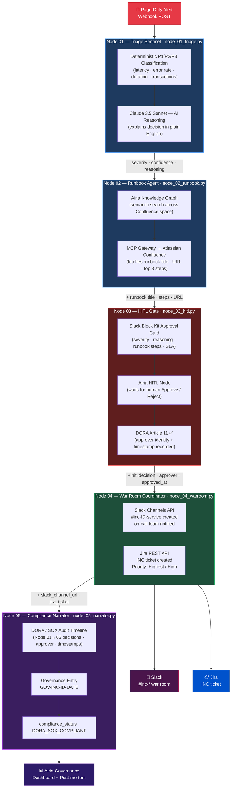

# Guardian — Architecture Reference

## Overview

Guardian is a five-node AI agent pipeline built on the Airia platform. All five nodes are **Python 3 code blocks** running inside Airia Agent Studio (`airia-ready/`). It eliminates the 8–12 minutes of manual coordination overhead at the start of every financial services production incident, and simultaneously produces the compliance audit trail required by DORA Article 11 and SOX Section 404.

## Pipeline Diagram



## Airia Features Used (All 16)

| # | Feature | Node | Purpose |
|---|---------|------|---------|
| 01 | Webhook Trigger | 01 | Receives PagerDuty alert webhook |
| 02 | Python Code Block | 01–05 | All pipeline logic — deterministic classification, API calls, audit trail |
| 03 | AI Model Call | 01, 05 | Reasoning explanation + root cause analysis |
| 04 | Structured Output | All | Type-safe JSON between nodes |
| 05 | Agent Variables | All | Context propagated through pipeline |
| 06 | Knowledge Graph | 02 | Semantic search across Confluence runbooks |
| 07 | MCP Gateway | 02, 04 | Atlassian Confluence + Jira + Slack (zero credentials) |
| 08 | MCP Apps | 03 | Interactive Slack approval buttons (Feb 2026) |
| 09 | Human-in-the-Loop | 03 | Mandatory DORA compliance checkpoint |
| 10 | Nested Agents | 04 | Slack + Jira sub-agents run in parallel |
| 11 | Slack Bot Deployment | 03, 04 | War room + HITL message channel |
| 12 | API Endpoint | 01 | Production-grade webhook receiver |
| 13 | Document Generator | 05 | Post-mortem PDF |
| 14 | Governance Dashboard | 05 | AI decision audit trail |
| 15 | Compliance Automation | 05 | DORA/SOX record generation |
| 16 | Community (×3) | All | Triage Sentinel, War Room, Compliance Narrator |

## Data Flow — Key Payloads

### Node 01 → Node 02
```json
{
  "incident_id": "INC-4471",
  "service": "payment-gateway",
  "severity": "P1",
  "confidence": 94,
  "reasoning": "Matched 4 of 4 P1 criteria. Critical service multiplier: true.",
  "ai_explanation": "...",
  "alert_raw": { "latencyMs": 847, "errorRate": 0.23, ... },
  "triggered_at": "...",
  "triage_completed_at": "..."
}
```

### Node 02 → Node 03
All Node 01 fields plus:
```json
{
  "runbooks": [{ "title": "...", "url": "...", "steps": [...], "owner": "payments-oncall" }],
  "runbook_retrieved_at": "..."
}
```

### Node 03 → Node 04
All Node 02 fields plus:
```json
{
  "hitl": {
    "decision": "approved",
    "approver": "U0123456789",
    "approver_name": "Jane Smith",
    "approved_at": "...",
    "response_time_seconds": 109
  }
}
```

### Node 04 → Node 05 (on resolution)
All Node 03 fields plus:
```json
{
  "slack_channel": "https://...",
  "slack_channel_id": "C123456",
  "jira_ticket": "INC-4471",
  "jira_url": "https://...",
  "oncall_notified": ["@payments-oncall", "@sre-lead"],
  "warroom_activated_at": "...",
  "resolved_at": "...",
  "sla_breached": false
}
```

## Severity Classification Logic

```
P1 (≥2 of 4 criteria):
  latencyMs ≥ 800    errorRate ≥ 0.15
  durationMin ≥ 3    transactionsAffected ≥ 1000

P2 (≥2 of 3 criteria):
  latencyMs ≥ 400    errorRate ≥ 0.05
  durationMin ≥ 5

P3: Everything else

Critical services (payment-gateway, fraud-detection, trading-api):
  All P1 thresholds × 0.8 (fires earlier)
```

## Security Design

- **Zero credentials in code** — All MCP Gateway connections store secrets in the Airia secrets vault
- **Deterministic-first AI** — The Node.js algorithm decides severity; the AI explains it. AI cannot override thresholds.
- **HITL as circuit breaker** — No automated action (Slack, Jira, PagerDuty pages) executes without human approval
- **Input validation** — All node inputs validated with Zod schemas before processing
- **Audit trail** — Every AI decision logged with model name, input, output, and confidence in Governance Dashboard

## Regulatory Compliance

| Framework | Requirement | Guardian Implementation |
|-----------|-------------|------------------------|
| DORA Art. 11 | ICT incident detection and classification | Node 01 deterministic algorithm + AI reasoning |
| DORA Art. 11 | Human oversight of AI recommendations | Node 03 HITL gate — mandatory approval |
| DORA Art. 11 | Incident timeline documentation | Node 05 post-mortem Section 2 |
| DORA Art. 11 | AI decision explainability | Node 05 Section 3 AI Decision Audit |
| SOX Sec. 404 | IT general controls documentation | Node 05 Section 4 compliance record |
| EU AI Act | AI system transparency | Governance Dashboard + full audit trail |
